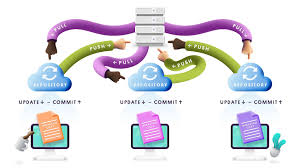

# ApuntesGitSCESI

# Introducción al Control de Versiones
---

## ¿Qué es un Control de Versiones?

Un sistema de control de versiones es una herramienta que registra cada cambio que se realiza en el código fuente de un proyecto. Permite:

- Mejor rendimiento, ya que solo guarda lo necesario.
- Seguridad: conserva todas las acciones y quién las realizó.
- Recuperación de cualquier versión anterior.
- Trabajo colaborativo en paralelo sin conflictos.

---

## Breve Historia

| Año  | Evento                                  |
|------|------------------------------------------|
| 1990 | Nace **CVS**, primer sistema de control de versiones. |
| 2005 | Creación de **Git** por la comunidad de desarrollo de Linux. |
| 2008 | Nace **GitHub** para alojar proyectos públicos. |
| 2018 | Microsoft compra GitHub. |
| 2024 | Git domina el mercado. |

> ⚡ Git puede conectarse también con BitBucket o GitLab. Facebook tiene su propia herramienta de control de versiones.

---

## ¿Qué es Git?

Es una herramienta de control de versiones distribuido. Puede tener uno o varios repositorios remotos para estar sincronizado con equipos de trabajo.

---

## ¿Qué es un Repositorio?

Un repositorio es una carpeta que almacena todos los archivos del proyecto y lleva un historial de cambios realizados en ellos.

---

## Crear un Repositorio Git

Puedes crear un nuevo repositorio con:

```bash
git init nombredelproyecto
cd nombredelproyecto

---

## Imagen relacionada


